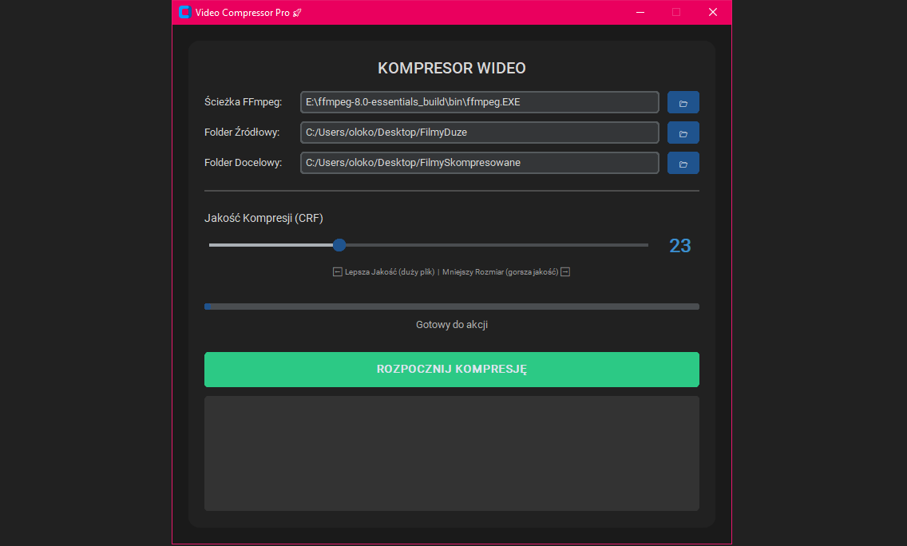

# Video Compressor Pro

Prosty i intuicyjny program do kompresji plików wideo (.mp4) z użyciem
**FFmpeg**.\
Aplikacja umożliwia szybkie zmniejszenie rozmiaru nagrań przy zachowaniu
wysokiej jakości, oferując tryb wsadowy oraz nowoczesny interfejs
graficzny.

------------------------------------------------------------------------

## 📥 Jak zdobyć aplikację?

Masz dwie opcje:

### 1. Pobierz gotowy plik `.exe` (Release)

Najłatwiejszy sposób dla użytkowników Windows.\
Wystarczy pobrać plik z zakładki **Releases**, uruchomić go i korzystać.

### 2. Zbuduj program samodzielnie

Jeśli chcesz wygenerować własną wersję:

1.  Zainstaluj wymagania:
    `bash     python -m pip install --upgrade pyinstaller ffmpeg-python customtkinter`
2.  Uruchom: `bash     build.bat`
3.  Gotowy plik znajduje się w folderze `dist/VideoCompressorPro.exe`.

------------------------------------------------------------------------

## 🛠️ Wymagania

-   **Python 3.x** (tylko jeśli budujesz samodzielnie)
-   **FFmpeg** -- musi być zainstalowany i dostępny w systemie
-   System operacyjny: **Windows 10/11**

------------------------------------------------------------------------

## 🚀 Używanie programu

1.  Uruchom aplikację.
2.  Wskaż ścieżkę do pliku `ffmpeg.exe` (zwykle wykrywa się
    automatycznie).
3.  Wybierz folder z plikami `.mp4` do kompresji.
4.  Wybierz folder, w którym zapiszą się skompresowane nagrania.
5.  Ustaw wartość CRF (jakość):
    -   niższa wartość = lepsza jakość, większy plik\
    -   wyższa wartość = mniejszy plik, gorsza jakość\
        Rekomendowane: **23**
6.  Kliknij **"ROZPOCZNIJ KOMPRESJĘ"**.

Postęp kompresji oraz logi będą wyświetlane w oknie programu.

